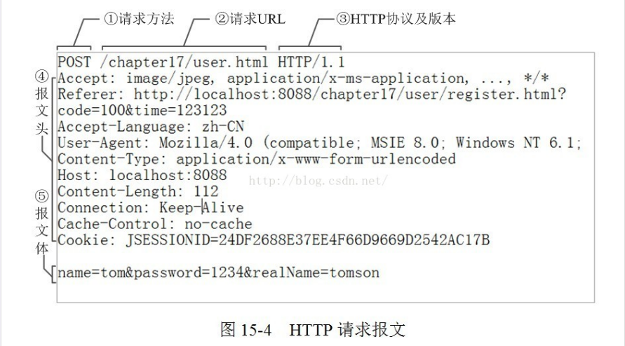
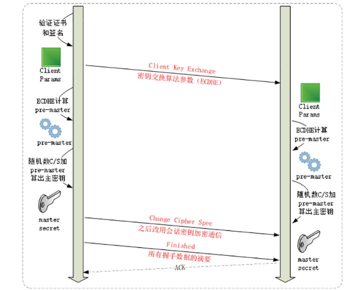
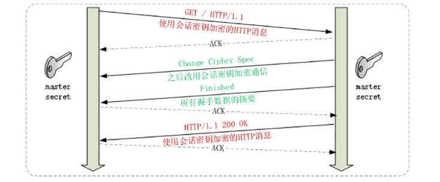

常见面试题

## 1.tcp和udp区别

1. UDP
   1. 在传输数据时不需要先建立连接，远程主机收到报文后不需要给出确认信息。
   2. 应用：qq语言，视频，直播
2. TCP
   1. 在数据传输之前**必须建立连接**，数据传输结束后**需要释放连接**
   2. TCP不提供广播或多播服务
   3. 可靠体现在：
      1. TCP在传输数据前会有**三次握手建立连接**
      2. 在数据传输时有**确认，窗口，重传，拥塞控制机制**，数据传输完成后会断开连接节约资源
   4. 缺点：
      1. 增加开销，确认，流量控制，计时器以及连接管理。
      2. 传输**首部数据单元增多**，占用处理资源
   5. 应用：文件传输，发送和接收邮件，远程登录

## 2.tcp三次握手和四次挥手

**本质：两端各自维护状态。**

1. 为什么要三次握手？
   1. **三次握手最主要的目的就是双方确认自己与对方的发送与接收是正常的。**三次握手（Three-way Handshake）其实就是指建立一个TCP连接时，需要客户端和服务器总共发送3个包。进行三次握手的主要作用就是为了确认双方的接收能力和发送能力是否正常、指定自己的初始化序列号为后面的可靠性传送做准备。实质上其实就是连接服务器指定端口，建立TCP连接，**并同步连接双方的序列号和确认号，交换TCP窗口大小信息。**
   2. 过程：
      1. 第一次握手：客户端给服务端发一个 SYN 报文，并指明客户端的初始化序列号 ISN。此时客户端处于 SYN_SENT状态。首部的同步位SYN=1，初始序号seq=x，**SYN=1的报文段不能携带数据**，但要消耗掉一个序号。**Client 什么都不能确认；Server 确认了对方发送正常，自己接收正常**
      2. 第二次握手：服务器收到客户端的 SYN 报文之后，会以自己的 SYN 报文作为应答，并且也是指定了自己的初始化序列号 ISN(s)。同时会把客户端的 ISN + 1 作为ACK 的值，表示自己已经收到了客户端的 SYN，此时服务器处于 SYN_RCVD的状态。在确认报文段中SYN=1，ACK=1，确认号ack=x+1，初始序号seq=y。**Client 确认了：自己发送、接收正常，对方发送、接收正常；Server 确认了：对方发送正常，自己接收正常**
      3. 第三次握手：客户端收到 SYN 报文之后，会发送一个 ACK 报文，当然，也是一样把服务器的 ISN + 1 作为 ACK 的值，表示已经收到了服务端的 SYN 报文，此时客户端处于ESTABLISHED状态。服务器收到 ACK 报文之后，也处于 ESTABLISHED 状态，此时，双方已建立起了连接。确认报文段ACK=1，确认号ack=y+1，序号seq=x+1（初始为seq=x，第二个报文段所以要+1），ACK报文段可以携带数据，不携带数据则不消耗序号。**Client 确认了：自己发送、接收正常，对方发送、接收正常；Server 确认了：自己发送、接收正常，对方发送、接收正常所以三次握手就能确认双发收发功能都正常，缺一不可。**

2. 握手时为什么要传回SYN？
   1. SYN是什么：SYN 是 TCP/IP 建立连接时使用的**握手信号**
   2. 作用：接收端传回发送端所发送的 SYN 是为了告诉发送端，我接收到的信息确实就是你所发送的信号了。

3. 传了SYN，为什么还要传ACK？

   1. ACK是什么：**确认字符** ,在数据通信传输中，接收站发给发送站的一种传输控制字符。它表示确认发来的数据已经接受无误。
   2. 作用：双方通信无误必须是两者互相发送信息都无误。传了 SYN，证明发送方到接收方的通道没有问题，但是接收方到发送方的通道还需要 ACK 信号来进行验证。

4. 为什么客服端最后还要发送一次确认？

   1. **主要防止已经失效的连接请求报文(滞留在网络中得)突然又传送到了服务器**，从而产生错误。
   2. 原因：
      1. 如果使用的是两次握手建立连接，客户端发送了第一个请求连接并且没有丢失，只是因为在网络结点中滞留的时间太长了，由于TCP的客户端迟迟没有收到确认报文，以为服务器没有收到，此时重新向服务器发送这条报文，此后客户端和服务器经过两次握手完成连接，传输数据，然后关闭连接。此时此前滞留的那一次请求连接，网络通畅了到达了服务器，这个报文本该是失效的，但是，两次握手的机制将会让客户端和服务器再次建立连接，这将导致不必要的错误和资源的浪费。
      2. 如果采用的是三次握手，就算是那一次失效的报文传送过来了，服务端接受到了那条失效报文并且回复了确认报文，但是客户端不会再次发出确认。由于服务器收不到确认，就知道客户端并没有请求连接。

5. ### 三次握手过程中可以携带数据吗？

   1. **第一次、第二次握手不可以携带数据**：假如第一次握手可以携带数据的话，如果有人要**恶意攻击服务器**，那他每次都在第一次握手中的 SYN 报文中放入大量的数据。因为攻击者根本就不理服务器的接收、发送能力是否正常，然后疯狂着重复发 SYN 报文的话，这会让服务器花费很多时间、内存空间来接收这些报文。
   2. **第一次握手不可以放数据，其中一个简单的原因就是会让服务器更加容易受到攻击了。而对于第三次的话，此时客户端已经处于 ESTABLISHED 状态。对于客户端来说，他已经建立起连接了，并且也已经知道服务器的接收、发送能力是正常的了，所以能携带数据也没啥毛病。**

6. 为什么需要四次挥手？

   

   1. 过程：
      1. **客户端**进程发出连接释放报文，并且停止发送数据。释放数据报文首部，FIN=1，其序列号为seq=u（等于前面已经传送过的数据的最后一个字节的序号加1），**此时，客户端进入FIN-WAIT-1（终止等待1）状态**。 TCP规定，FIN报文段即使不携带数据，也要消耗一个序号。
      2. **服务器**收到连接释放报文，发出确认报文，ACK=1，ack=u+1，并且带上自己的序列号seq=v，**此时，服务端就进入了CLOSE-WAIT（关闭等待）状态。**TCP服务器通知高层的应用进程，客户端向服务器的方向就释放了，**这时候处于半关闭状态，即客户端已经没有数据要发送了，但是服务器若发送数据，客户端依然要接受。这个状态还要持续一段时间，也就是整个CLOSE-WAIT状态持续的时间。**
      3. **客户端**收到服务器的确认请求后，**此时，客户端就进入FIN-WAIT-2（终止等待2）状态**，等待服务器发送连接释放报文（在这之前**还需要接受服务器发送的最后的数据**）。
      4. **服务器**将最后的数据发送完毕后，就向客户端发送连接释放报文，FIN=1，ack=u+1，由于在半关闭状态，服务器很可能又发送了一些数据，假定此时的序列号为seq=w，此时，**服务器就进入了LAST-ACK（最后确认）状态，等待客户端的确认。**
      5. **客户端**收到服务器的连接释放报文后，必须发出确认，ACK=1，ack=w+1，而自己的序列号是seq=u+1，此时，**客户端就进入了TIME-WAIT（时间等待）状态。**注意此时TCP连接还没有释放，**必须经过2*MSL（最长报文段寿命）的时间后**，当客户端撤销相应的TCB后，才进入CLOSED状态。
      6. **服务器**只要收到了客户端发出的确认，立即进入CLOSED状态。同样，撤销TCB后，就结束了这次的TCP连接。可以看到，服务器结束TCP连接的时间要比客户端早一些。
   2. 举个例子：A 和 B 打电话，通话即将结束后，A 说“我没啥要说的了”，B回答“我知道了”，但是 B 可能还会有要说的话，A 不能要求 B 跟着自己的节奏结束通话，于是 B 可能又巴拉巴拉说了一通，最后 B 说“我说完了”，A 回答“知道了”，这样通话才算结束。

## 3.浏览器输入url后详细过程

1. 浏览器查找域名ip地址
   1. DNS查找过程：浏览器缓存>路由器缓存>DNS缓存
   2. 相关协议：NDS协议

2. 浏览器向web服务器发送一个HTTP请求：cookies会一起发送

3. 三次握手建立连接

4. 服务器处理请，求返回响应 

5. 浏览器回复确认

6. 浏览器渲染显示

7. 关闭链接，四次挥手

8. 2-7相关协议：

   1. TCP：与服务器建立连接，3握手4挥手，长链接
   2. IP：建立TCP协议是，需要发送数据，发送数据在网络层使用IP协议
   3. OPSF：IP数据包在路由器之间，路由器选择使用OPSF协议
   4. ARP：路由器在于服务器通信时，需要将IP地址装换为MAC地址
   5. HTTP：在TCP建立完成后，使用HTTP协议访问网页

9. 样例：假设你要访问的是 Apple 网站，显然你是不知道它的真实 IP 地址的，在浏览器里只能使用域名“www.apple.com”访问，那么接下来要做的必然是域名解析。这就要用 DNS 协议开始从操作系统、本地 DNS、根 DNS、顶级 DNS、权威 DNS 的层层解析，当然这中间有缓存，可能不会费太多时间就能拿到结果。

   别忘了互联网上还有另外一个重要的角色 CDN，它也会在 DNS 的解析过程中“插上一脚”。DNS 解析可能会给出 CDN 服务器的 IP 地址，这样你拿到的就会是 CDN 服务器而不是目标网站的实际地址。

   因为 CDN 会缓存网站的大部分资源，比如图片、CSS 样式表，所以有的 HTTP 请求就不需要再发到 Apple，CDN 就可以直接响应你的请求，把数据发给你。

   由 PHP、Java 等后台服务动态生成的页面属于“动态资源”，CDN 无法缓存，只能从目标网站获取。于是你发出的 HTTP 请求就要开始在互联网上的“漫长跋涉”，经过无数的路由器、网关、代理，最后到达目的地。

   目标网站的服务器对外表现的是一个 IP 地址，但为了能够扛住高并发，在内部也是一套复杂的架构。通常在入口是负载均衡设备，例如四层的 LVS 或者七层的 Nginx，在后面是许多的服务器，构成一个更强更稳定的集群。

   负载均衡设备会先访问系统里的缓存服务器，通常有 memory 级缓存 Redis 和 disk 级缓存 Varnish，它们的作用与 CDN 类似，不过是工作在内部网络里，把最频繁访问的数据缓存几秒钟或几分钟，减轻后端应用服务器的压力。

   如果缓存服务器里也没有，那么负载均衡设备就要把请求转发给应用服务器了。这里就是各种开发框架大显神通的地方了，例如 Java 的 Tomcat/Netty/Jetty，Python 的 Django，还有 PHP、Node.js、Golang 等等。它们又会再访问后面的 MySQL、PostgreSQL、MongoDB 等数据库服务，实现用户登录、商品查询、购物下单、扣款支付等业务操作，然后把执行的结果返回给负载均衡设备，同时也可能给缓存服务器里也放一份。

   应用服务器的输出到了负载均衡设备这里，请求的处理就算是完成了，就要按照原路再走回去，还是要经过许多的路由器、网关、代理。如果这个资源允许缓存，那么经过 CDN 的时候它也会做缓存，这样下次同样的请求就不会到达源站了。

   最后网站的响应数据回到了你的设备，它可能是 HTML、JSON、图片或者其他格式的数据，需要由浏览器解析处理才能显示出来，如果数据里面还有超链接，指向别的资源，那么就又要重走一遍整个流程，直到所有的资源都下载完。

## 4.TCP协议如何保证可靠传输

1. 基本保障：

   1. **链接管理**：三次握手四次挥手

   2. **确认应答+序列号：**应用数据被分割成 TCP 认为最适合发送的数据块。TCP 给发送的每一个包进行编号(序列号)，接收方对数据包进行排序，把有序数据传送给应用层。

      

   3. **校验和：** TCP 将保持它首部和数据的检验和。这是一个端到端的检验和，目的是检测数据在传输过程中的任何变化。如果收到端的检验和有差错，TCP 将丢弃这个报文段和不确认收到此报文段。

      

   4. TCP 的接收端会丢弃重复的数据。

   5. **超时重传：** 当 TCP 发出一个段后，它启动一个定时器，等待目的端确认收到这个报文段。如果不能及时收到一个确认，将重发这个报文段。

      1. 数据在传输过程中由于网络原因等直接全体丢包，接收方根本没有接收到。
      2. 接收方接收到了响应的数据，但是发送的ACK报文响应却由于网络原因丢包了。
      3. 解决：
         1. 如果是第一个原因，接收方收到二次重发的数据后，便进行ACK应答。
         2. 如果是第二个原因，接收方发现接收的数据已存在（判断存在的根据就是序列号，所以上面说序列号还有去除重复数据的作用），那么**直接丢弃，仍旧发送ACK应答。**
      4. 超时计算方式：在Linux中（BSD Unix和Windows下也是这样）**超时以500ms为一个单位进行控制**，每次判定超时重发的超时时间都是500ms的整数倍。重发一次后，仍未响应，那么等待2x500ms的时间后，再次重传。等待4x500ms的时间继续重传。**以一个指数的形式增长。累计到一定的重传次数，TCP就认为网络或者对端出现异常，强制关闭连接。**

   6. **流量控制：** TCP 连接的每一方都有**固定大小的缓冲空间**，TCP的接收端只允许发送端发送接收端缓冲区能接纳的数据。当接收方来不及处理发送方的数据，能提示发送方降低发送的速率，防止包丢失。TCP 使用的流量控制协议是可变大小的滑动窗口协议。 （TCP 利用滑动窗口实现流量控制）

      

   7. **拥塞控制：** 当网络拥塞时，减少数据的发送。

      

      1. 产生原因：TCP传输的过程中，发送端开始发送数据的时候，如果刚开始就发送大量的数据，那么就可能造成一些问题。网络可能在开始的时候就很拥堵，如果给网络中在扔出大量数据，那么这个拥堵就会加剧。**拥堵的加剧就会产生大量的丢包，就对大量的超时重传，严重影响传输。**
      2. 解决方案：
         1. **慢启动机制**
            1. 在开始发送数据时，先发送少量的数据探路。探清当前的网络状态如何，再决定多大的速度进行传输。这时候就引入一个叫做拥塞窗口的概念。发送刚开始定义拥塞窗口为 1，每次收到ACK应答，拥塞窗口加 1倍。**在发送数据之前，首先将拥塞窗口与接收端反馈的窗口大小比对，取较小的值作为实际发送的窗口。**
            2. 拥塞窗口的增长是指数级别的。慢启动的机制只是说明在开始的时候发送的少，发送的慢，但是增长的速度是非常快的
            3. 为了控制拥塞窗口的增长，不能使拥塞窗口单纯的加倍，设置一个**拥塞窗口的阈值**，当拥塞窗口大小超过阈值时，不能再按照指数来增长，而是线性的增长。在慢启动开始的时候，慢启动的阈值等于窗口的最大值，一旦造成网络拥塞，发生超时重传时，慢启动的阈值会为原来的一半**（这里的原来指的是发生网络拥塞时拥塞窗口的大小）**，同时拥塞窗口重置为 1。
         2. **拥塞避免：** 拥塞避免算法的思路是让拥塞窗口cwnd缓慢增大，即每经过一个往返时间RTT就把发送放的cwnd加1.
         3. **快重传与快恢复：** 在 TCP/IP 中，快速重传和恢复（fast retransmit and recovery，FRR）是一种拥塞控制算法，它能快速恢复丢失的数据包。没有 FRR，如果数据包丢失了，TCP 将会使用定时器来要求传输暂停。在暂停的这段时间内，没有新的或复制的数据包被发送。有了 FRR，如果接收机接收到一个不按顺序的数据段，它会立即给发送机发送一个重复确认。如果发送机接收到三个重复确认，它会假定确认件指出的数据段丢失了，并立即重传这些丢失的数据段。有了 FRR，就不会因为重传时要求的暂停被耽误。当有单独的数据包丢失时，快速重传和恢复（FRR）能最有效地工作。当有多个数据信息包在某一段很短的时间内丢失时，它则不能很有效地工作。

   8. **ARQ协议：** 也是为了实现可靠传输的，它的基本原理就是每发完一个分组就停止发送，等待对方确认。在收到确认后再发下一个分组。

2. ARQ协议：**自动重传请求**

   1. 是OSI模型中数据链路层和传输层的错误纠正协议之一。它通过使用确认和超时这两个机制，在不可靠服务的基础上实现可靠的信息传输。如果发送方在发送后一段时间之内没有收到确认帧，它通常会重新发送。ARQ包括停止等待ARQ协议和连续ARQ协议。

3. 停止等待协议

   1. 停止等待协议是为了实现可靠传输的，它的基本原理就是每发完一个分组就停止发送，等待对方确认（回复ACK）。如果过了一段时间（超时时间后），还是没有收到 ACK 确认，说明没有发送成功，需要重新发送，直到收到确认后再发下一个分组；
   2. 在停止等待协议中，若接收方收到重复分组，就丢弃该分组，但同时还要发送确认；
   3. 优点：简单
   4. 缺点：信道利用率低，等待时间长
   5. **无差错情况**：发送方发送分组,接收方在规定时间内收到,并且回复确认.发送方再次发送。
   6. **出现差错情况（超时重传）**：停止等待协议中超时重传是指只要超过一段时间仍然没有收到确认，就重传前面发送过的分组（认为刚才发送过的分组丢失了）。因此每发送完一个分组需要设置一个超时计时器，其重传时间应比数据在分组传输的平均往返时间更长一些。这种自动重传方式常称为 **自动重传请求 ARQ** 。另外在停止等待协议中若收到重复分组，就丢弃该分组，但同时还要发送确认。
   7. **确认丢失和确认迟到**：**确认丢失** ：确认消息在传输过程丢失。当A发送M1消息，B收到后，B向A发送了一个M1确认消息，但却在传输过程中丢失。而A并不知道，在超时计时过后，A重传M1消息，B再次收到该消息后采取以下两点措施：1. 丢弃这个重复的M1消息，不向上层交付。 2. 向A发送确认消息。（不会认为已经发送过了，就不再发送。A能重传，就证明B的确认消息丢失）。**确认迟到** ：确认消息在传输过程中迟到。A发送M1消息，B收到并发送确认。在超时时间内没有收到确认消息，A重传M1消息，B仍然收到并继续发送确认消息（B收到了2份M1）。此时A收到了B第二次发送的确认消息。接着发送其他数据。过了一会，A收到了B第一次发送的对M1的确认消息（A也收到了2份确认消息）。处理如下：1. A收到重复的确认后，直接丢弃。2. B收到重复的M1后，也直接丢弃重复的M1。

4. 连续 ARQ 协议

   1. 连续 ARQ 协议可提高信道利用率。发送方维持一个发送窗口，凡位于发送窗口内的分组可以连续发送出去，而不需要等待对方确认。接收方一般采用累计确认，对按序到达的最后一个分组发送确认，表明到这个分组为止的所有分组都已经正确收到了。
   2. 优点： 信道利用率高，容易实现，即使确认丢失，也不必重传。
   3. 缺点：不能向发送方反映出接收方已经正确收到的所有分组的信息。 比如：发送方发送了 5条 消息，中间第三条丢失（3号），这时接收方只能对前两个发送确认。发送方无法知道后三个分组的下落，而只好把后三个全部重传一次。这也叫 Go-Back-N（回退 N），表示需要退回来重传已经发送过的 N 个消息。

## 5.HTTP与HTTPS的区别

1. 端口
   1. http：80
   2. https：443
2. 架构
   1. http：运行在TCP上
   2. https：运行在SSL/TLS上，SSL/TLS运行在TCP上
3. 安全
   1. http：所有**传输的内容都是明文，客户端和服务器端都无法验证对方的身份。**
   2. https：所有**传输的内容都经过加密，加密采用对称加密，但对称加密的密钥用服务器方的证书进行了非对称加密。**
      1. 对称加密：密钥只有一个，**加密解密为同一个密码**，且加解密速度快，典型的对称加密算法有DES、AES等；
      2. 非对称加密：密钥成对出现（且根据公钥无法推知私钥，根据私钥也无法推知公钥），**加密解密使用不同密钥（公钥加密需要私钥解密，私钥加密需要公钥解密）**，相对对称**加密速度较慢**，典型的非对称加密算法有RSA、DSA等。
   3. 所以说，**HTTP 安全性没有 HTTPS高，但是 HTTPS 比HTTP耗费更多服务器资源**

## 6.HTTP1.0与HTTP1.1区别

1. **长连接** : **在HTTP/1.0中，默认使用的是短连接**，也就是说每次请求都要重新建立一次连接。HTTP 是基于TCP/IP协议的,**每一次建立或者断开连接都需要三次握手四次挥手的开销，如果每次请求都要这样的话，开销会比较大**。因此最好能维持一个长连接，可以用个长连接来发多个请求。**HTTP 1.1起，默认使用长连接** ,默认开启Connection： keep-alive。 **HTTP/1.1的持续连接有非流水线方式和流水线方式** 。流水线方式是客户在收到HTTP的响应报文之前就能接着发送新的请求报文。与之相对应的非流水线方式是客户在收到前一个响应后才能发送下一个请求。
2. **错误状态响应码** :在HTTP1.1中新增了24个错误状态响应码，如409（Conflict）表示请求的资源与资源的当前状态发生冲突；410（Gone）表示服务器上的某个资源被永久性的删除。
3. **缓存处理** :在HTTP1.0中主要使用header里的If-Modified-Since,Expires来做为缓存判断的标准，HTTP1.1则引入了更多的缓存控制策略例如Entity tag，If-Unmodified-Since, If-Match, If-None-Match等更多可供选择的缓存头来控制缓存策略。
4. **带宽优化及网络连接的使用** :HTTP1.0中，存在一些浪费带宽的现象，例如客户端只是需要某个对象的一部分，而服务器却将整个对象送过来了，并且不支持断点续传功能，**HTTP1.1则在请求头引入了range头域，它允许只请求资源的某个部分，即返回码是206（Partial Content），这样就方便了开发者自由的选择以便于充分利用带宽和连接**。

## 7.TCP黏包问题

1. **产生原因**（传输机制问题）

   1. 如果利用tcp每次发送数据，就与对方建立连接，然后双方发送完一段数据后，就关闭连接，这样就不会出现粘包问题

   2. 如果发送数据无结构，如文件传输，这样发送方只管发送，接收方只管接收存储就ok，也不用考虑粘包

   3. **TCP是一个基于字节流的传输服务，"流"意味着TCP所传输的数据是没有边界的**。这不同于UDP提供基于消息的传输服务，其传输的数据是有边界的。TCP的发送方无法保证对等方每次接收到的是一个完整的数据包。

      

   4. 产生本质**(无法区分包界限)**：

      1. 主要是由于现代操作系统的网络传输机制所产生的。我们知道，网络通信采用的套接字(socket)技术，其实现实际是由系统内核提供一片连续缓存(流缓冲)来实现应用层程序与网卡接口之间的中转功能。多个数据包被连续存储于连续的缓存中，在对数据包进行读取时由于无法确定发生方的发送边界，而采用某一估测值大小来进行数据读出，若双方的size不一致时就会使数据包的边界发生错位，导致读出错误的数据分包，进而曲解原始数据含义
      2. **发送端需要等缓冲区满才发送出去，造成粘包**：由Nagle算法造成的发送端的粘包
      3.  **接收方不及时接收缓冲区的包，造成多个包接收**

2. **解决**

   1. 定长发送，不足的部分填充空白字节。**网络负载的无效浪费**

   2. 尾部标记序列,特定分割符区分界限

   3. 头部标记分步接收，包都需要多封装sizeof(_data_head)的数据，接收动作分成了两次

      

## 8.TCP中Timewait的作用

1. 可靠的终止TCP连接。

   1. **若处于time_wait的client发送给server确认报文段丢失的话，server将在此又一次发送FIN报文段，那么client必须处于一个可接收的状态就是time_wait而不是close状态。**

2. **保证让迟来的TCP报文段有足够的时间被识别并丢弃。**

   1. linux 中一个TCPport不能打开两次或两次以上。当client处于time_wait状态时我们将无法使用此port建立新连接，假设不存在time_wait状态，新连接可能会收到旧连接的数据。

3. 持续时间

   1. **2MSL**
   2. MSL是TCP协议数据报中，任意一段数据在网络上被丢弃之前保持可用的最大时间

4. 举例：

   1. 注意一个问题，进入TIME_WAIT状态的一般情况下是客户端。大多数服务器端一般执行被动关闭，服务器不会进入TIME_WAIT状态。当在服务器端关闭某个服务再重启时，服务器是会进入TIME_WAIT状态的。

      举个例子：

      ​       1.客户端连接服务器端的80服务，这时客户端会启用一个本地的端口访问服务器的80，访问完成后关闭此连接，立刻再次访问服务器的80，这时客户端会启用本地的另一个端口，而不是刚才使用的那个本地端口，原因就是刚才的那个连接还处于TIME_WAIT状态。

      ​       2.客户端连接服务器的80服务，这时服务器关闭80端口，立刻再次重启80端口的服务，这时可能不会成功启动，原因也是服务器的连接还处于TIME_WAIT状态。

      ​      服务器提供服务时，一般监听一个端口就够了（例如80端口），客户端则是使用一个本地的空闲端口（大于1024），与服务器的80端口建立连接，当通信使用短连接，并且由客户端主动关闭连接时，主动关闭连接的客户端会产生TIME_WAIT状态的连接，一个TIME_WAIT状态的连接就占用了一个本地端口。这样在TIME_WAIT状态结束之前，本地最多能承受6万多个TIME_WAIT状态的连接，就无端口可用了。客户端与服务器进行短连接的TCP通信，如果在同一台机器上进行压力测试模拟上万的客户请求，并且循环与服务器端进行短连接通信，那么这台机器将产生4000个左右的TIME_WAIT socket，后续的短连接就会产生address already in use：connect的异常。

   2. 服务器提供服务时，一般监听一个端口就够了（例如80端口），客户端则是使用一个本地的空闲端口（大于1024），与服务器的80端口建立连接，当通信使用短连接，并且由服务端主动关闭连接时，主动关闭连接的服务端会产生TIME_WAIT状态的连接。由于都连接到服务器端80端口，服务器端的TIME_WAIT状态的连接会有很多个，假如server一秒钟处理1000个请求，那么就会积压240秒*1000=24万个TIME_WAIT的记录，服务器有能力维护这24万个记录。

      ​       **大多数服务器端一般执行被动关闭**，服务器不会进入TIME_WAIT状态，服务端为了解决这个TIME_WAIT问题，可选的方式有3种：

      1. 保证由客户端主动发起关闭
      2. 关闭的时候使用RST方式
      3. 对处于TIME_WAIT状态的TPC允许重用

5. 总结：我们知道TIME_WAIT状态是友好的，并不是多余的，TCP要保证在所有可能的情况下使得所有的数据都能够正确送达。当你关闭一个scket时，主动关闭一端的socket将进入TIME_WAIT状态，而被动关闭的一方则进入CLOSED状态，这的确能够保证所有的数据都被传送。当一个SOCKET关闭的时候，是通过两端四次挥手完成的，当一端调用close（）时，就说明本端没有数据要传送了，这好似看来在握手完成以后，socket就可以处于CLOSED状态了，其实不然，原因是这样安排状态有两个问题，**首先我们没有任何机制保证最后的一个ACK能够正常传输，第二，网络仍然可能有残余的数据包，我们也必须能够正常处理。**

## 9.拥塞控制

1. 是什么？

   防止过多的数据注入到网络当中，这样可以使网络中的路由器或链路不致过载

2. 解决：

   1. 慢开始

      1. 预知
         1. 接收端窗口rwnd，又称通知窗口（awnd），是接收端根据目前的接收缓存大小所许诺的最新窗口值，是来自接收端的流量控制
         2. 拥塞窗口cwnd是发送端根据自己估计的网络阻塞程度而设置的窗口值，是来自发送端的流量控制。
         3. 发送将拥塞窗口作为发送窗口swnd=cwnd
         4. ssthresh状态变量，门限
      2. 假设当前发送方拥塞窗口cwnd的值为1，而发送窗口swnd等于拥塞窗口cwnd，因此发送方当前只能发送一个数据报文段（拥塞窗口cwnd的值是几，就能发送几个数据报文段），接收方收到该数据报文段后，给发送方回复一个确认报文段，发送方收到该确认报文后，将拥塞窗口的值变为2，发送方此时可以连续发送两个数据报文段，接收方收到该数据报文段后，给发送方一次发回2个确认报文段，发送方收到这两个确认报文后，将拥塞窗口的值加2变为4，发送方此时可连续发送4个报文段
      3. 当前的拥塞窗口cwnd的值已经等于慢开始门限值，之后改用拥塞避免算法
      4. 局限：
         1. **需要获得网络内部流量分布的信息，浪费可用的网络容量，额外开销；**
         2. **估算合理的ssthresh值并不容易，可能耗时较长；** 

   2. 拥塞避免

      1. 也就是每个传输轮次，拥塞窗口cwnd只能线性加一，而不是像慢开始算法时，每个传输轮次，拥塞窗口cwnd按指数增长
      2. 假设24个报文段在传输过程中丢失4个，接收方只收到20个报文段，给发送方依次回复20个确认报文段，一段时间后，丢失的4个报文段的重传计时器超时了，发送放判断可能出现拥塞，更改cwnd和ssthresh.并重新开始慢开始算法

      

      

   3. 快重传

      

   4. 快恢复

      

## 10.TCP Keep alive

1. 起源：双方建立交互的连接，但是并不是一直存在数据交互，有些连接会在数据交互完毕后，主动释放连接，而有些不会，那么在长时间无数据交互的时间段内，交互双方都有可能出现掉电、死机、异常重启等各种意外，当这些意外发生之后，这些TCP连接并未来得及正常释放，那么，连接的另一方并不知道对端的情况，它会一直维护这个连接，长时间的积累会导致非常多的**半打开连接**，造成端系统资源的消耗和浪费，为了解决这个问题，**在传输层可以利用TCP的保活报文来实现**

2. 造成原因

   1. 客户端或服务器端意外断电、死机、崩溃、重启
   2. 中间网络已经中断，而客户端与服务器端并不知道
   3. **中间设备因超时删除连接相关的连接表**：这种情况在**有防火墙的应用环境下非常常见**，这会给某些长时间无数据交互但是又要长时间维持连接的应用（如数据库）带来很大的影响，为了解决这个问题，应用本身或TCP可以通过保活报文来维持中间设备中该连接的信息

3. 工作原理

   

4. 影响

   1. **中间设备因大量保活连接，导致其连接表满**：网关设备由于保活问题，导致其连接表满，无法新建连接（XX局网闸故障案例）或性能下降严重
   2. **正常连接被释放**：当连接一端在发送保活探测报文时，中间网络正好由于各种异常（如链路中断、中间设备重启等）而无法将该保活探测报文正确转发至对端时，可能会导致探测的一方释放本来正常的连接，但是这种可能情况发生的概率较小，另外，一般也可以增加保活探测报文发生的次数来减小这种情况发生的概率和影响。
   3. 需要消耗额外的宽带和流量

5. 案例：  某财务应用，在客户端需要填写大量的表单数据，在客户端与服务器端建立TCP连接后，客户端终端使用者将花费几分钟甚至几十分钟填写表单相关信息，终端使用者终于填好表单所需信息后，点击“提交”按钮，结果，这个时候由于中间设备早已经将这个TCP连接从连接表中删除了，其将直接丢弃这个报文或者给客户端发送RST报文，应用故障产生，这将导致客户端终端使用者所有的工作将需要重新来过，给使用者带来极大的不便和损失。

6. **注意：**TCP Keepalive 和 HTTP Keep-Alive 这两个概念搞混淆。**HTTP协议的Keep-Alive意图在于TCP连接复用**，同一个连接上串行方式传递请求-响应数据；**TCP的Keepalive机制意图在于探测连接的对端是否存活。**

## 11.udp实现tcp可靠传输

## 12.tcp的SYN和ACK是干什么的

## 13.SYN攻击

**SYN 攻击包括大量此类的包，由于这些包看上去来自实际不存在的站点，因此无法有效进行处理。每个机器的欺骗包都要花几秒钟进行尝试方可放弃提供正常响应。**（在黑客攻击事件中，SYN攻击是最常见又最容易被利用的一种攻击手法。 **SYN攻击属于DOS攻击的一种**，它利用TCP协议缺陷，通过发送大量的半连接请求，耗费CPU和内存资源。SYN攻击除了能影响主机外，还可以危害路由器、防火墙等网络系统，事实上SYN攻击并不管目标是什么系统，只要这些系统打开TCP服务就可以实施。服务器接收到连接请求（syn= j），将此信息加入未连接队列，并发送请求包给客户（syn=k,ack=j+1），此时进入SYN_RECV状态。**当服务器未收到客户端的确认包时，重发请求包，一直到超时，才将此条目从未连接队列删除。**配合IP欺骗，SYN攻击能达到很好的效果，通常，客户端在短时间内伪造大量不存在的IP地址，向服务器不断地发送syn包，服务器回复确认包，并等待客户的确认，由于源地址是不存在的，服务器需要不断的重发直至超时，这些伪造的SYN包将长时间占用未连接队列，正常的SYN请求被丢弃，目标系统运行缓慢，严重者引起网络堵塞甚至系统瘫痪。 关于SYN攻击防范技术，人们研究得比较早。归纳起来，主要有两大类，一类是通过防火墙、路由器等过滤网关防护，另一类是通过加固TCP/IP协议栈防范。但必须清楚的是，SYN攻击不能完全被阻止，我们所做的是尽可能的减轻SYN攻击的危害，除非将TCP协议重新设计。）

## 14.OSI网络模型

1. 应用层
   1. 协议：HTTP，HTTPS，FTP，POP3、SMTP等
2. 表示层：表示层提供一种通用的数据描述格式，便于不同系统间的机器进行信息转换和相互操作，如会话层完成EBCDIC编码（大型机上使用）和ASCII码（PC机器上使用）之间的转换。表示层的主要功能有：数据语法转换、语法表示、数据加密和解密、数据压缩和解压。
3. 会话层：
4. 输出层：传输层利用实现可靠的端到端的数据传输能实现数据分段、传输和组装，还提供差错控制和流量／拥塞控制等功能
5. 网络层：网络层控制子网的通信，其主要功能是提供路由选择，即选择到达目的的主机的最优路径并沿着该路径传输数据包。网络层还应该具备的功能有：路由选择和中继；激活和终止网络连接；链路复用；差错检测和恢复；流量／拥塞控制等
6. 数据链路层：数据库链路层将原始的传输线路转变成一条逻辑的传输线路，实现实体间二进制信息块的正确传输，为网络层提供可靠的数据信息。数据链路层的数据单位是帧，具有流量控制功能。链路是相邻两节点间的物理线路
   1. 链路连接的建立、拆除和分离：数据传输所依赖的介质是长期的，但传输数据的实体间的连接是有生存期的。在连接生存期内，收发两端可以进行不等的一次或多次数据通信，每次通信都要经过建立通信联络、数据通信和拆除通信联络这三个过程
   2. 帧定界和帧同步：数据链路层的数据传输单元是帧，由于数据链路层的协议不同，帧的长短和界面也不同，所以必须对帧进行定界和同步。
   3. 顺序控制：对帧的收发顺序进行控制
   4. 差错检测、恢复：差错检测多用方阵码校验和循环码校验来检测信道上数据的误码，而帧丢失等用序号检测。各种错误的恢复则常靠反馈重发技术来完成。
   5. 链路标识、流量／拥塞控制。
      局域网中的数据链路层可以分为逻辑链路控制(Logical Link Control，LLC)和介质访问控制(Media Access Control,MAC)两个子层。其中LLC只在使用802.3格式的时候才会用到，而如今很少使用802.3格式，取而代之的是以太帧格式，而使用以太帧格式则不会有LLC存在。
7. 物理层位于OSI/RM参考模型的最底层，为数据链路层实体提供建立、传输、释放所必须的物理连接，并提供透明的比特流传输。物理层的链接可以是全双工或者半双工方式，传输方式可以是异步或同步方式。物理层的数据单位是比特，即一个二进制位。物理层构建在物理传输介质和硬件设备相连接之上，向上服务于紧邻的数据链路层。

## 15.HTTPS

1. 通常认为，如果通信过程具备了四个特性，就可以认为是“安全”的，这四个特性是：机密性、完整性，身份认证和不可否认。

2. 是什么：HTTPS是身披SSL外壳的HTTP。HTTPS是一种通过计算机网络进行安全通信的传输协议，经由HTTP进行通信，利用SSL/TLS建立全信道，加密数据包。HTTPS使用的主要目的是提供对网站服务器的身份认证，同时保护交换数据的隐私与完整性。**“安全”分两部分，一是传输内容加密、二是服务端的身份认证**

3. 实现机制：

   1. **HTTPS = HTTP+STL**
   2. 特点：由“**HTTP over TCP/IP**”变成了“**HTTP over SSL/TLS**”，让 HTTP 运行在了安全的 SSL/TLS 协议上，收发报文不再使用 Socket API，而是调用专门的安全接口。
   3. 内容加密：采用**混合加密技术**，中间者无法直接查看明文内容
   4. 验证身份：通过**证书认证**客户端访问的是自己的服务器
   5. 保护数据完整性：防止传输的内容被中间人冒充或者篡改
   6. 技术点：
      1. **混合加密：**结合非对称加密和对称加密技术。客户端使用对称加密生成密钥对传输数据进行加密，然后使用非对称加密的公钥再对秘钥进行加密，所以网络上传输的数据是被秘钥加密的密文和用公钥加密后的秘密秘钥，因此即使被黑客截取，由于没有私钥，无法获取到加密明文的秘钥，便无法获取到明文数据。
      2. **数字摘要：**通过单向hash函数对原文进行哈希，将需加密的明文“摘要”成一串固定长度(如128bit)的密文，不同的明文摘要成的密文其结果总是不相同，同样的明文其摘要必定一致，并且即使知道了摘要也不能反推出明文。
      3. **数字签名技术：**签名就是在信息的后面再加上一段内容（信息经过hash后的值），可以证明信息没有被修改过。hash值一般都会加密后（也就是签名）再和信息一起发送，以保证这个hash值不被修改。

4. 发展过程：

   1. HTTP阶段

      1. 发送过程

      

      2. 安全隐患
         1. **窃听风险**：黑客可以获知通信内容
         2. **篡改风险**：黑客可以修改通信内容
         3. **冒充风险**：黑客可以冒充他人身份参与通信

      

   2. HTTP向HTTPS演化过程

      1. 传输加密(对称加密)

         

         1. 目前常用的只有 AES 和 ChaCha20。
         2. 缺点
            1. 不同的客户端、服务器数量庞大，所以双方都需要**维护大量的密钥，维护成本很高**
            2. 因每个客户端、服务器的安全级别不同，**密钥极易泄露，只要黑客拿到秘钥就可以完整解密传输内容**
            3. 两边需要使用相同的密钥，**需要使用一种安全的方式交换密钥**，单纯使用对称加密，无法实现密钥交换。

      2. 传输加密(非对称加密)

         

         1. 非对称加密使用两个密钥：公钥和私钥，公钥可以任意分发而私钥保密，解决了密钥交换问题但速度慢，常用的有 RSA 和 ECC；
         2. 注意：只使用服务器端的私钥和公钥，所以肯定是单向加密的。相反方向也要加密的话，那么客户端也需要提供私钥和公钥。双方加密都使用对方的公钥，而且解密都得使用各自的私钥。这样是可以满足安全通信得。
         3. 缺点：性能上不够优
            1. 只使用非对称加密是可以满足安全性要求的，但是由于**非对称加密的计算耗时高于对称加密的2-3个数量级（相同安全加密级别），只适合对少量数据进行加密。**，所以才先使用非对称交换密钥，之后再使用对称加密通信。

      3. 传输加密(混合加密)

         

         

         1. 步骤：

            1. 第 ③ 步时，客户端说：（咱们后续回话采用对称加密吧，这是对称加密的算法和对称密钥）这段话用公钥进行加密，然后传给服务器。**加密对称加密的密钥**
            2. 服务器收到信息后，**用私钥解密，提取出对称加密算法和对称密钥后**，服务器说：（好的）对称密钥加密
            3. 后续两者之间信息的传输就可以使用对称加密的方式了

         2. 缺点：

            

            1. **数据如何完整性保证**
            2. **客户端如何获得公钥**
            3. **如何确认服务器是真实的而不是黑客**

      4. 完整性：**摘要算法**

         1. 算法：SHA-2 实际上是一系列摘要算法的统称，总共有 6 种，常用的有 SHA224、SHA256、SHA384，分别能够生成 28 字节、32 字节、48 字节的摘要。

         2. 是什么：SHA-2 实际上是一系列摘要算法的统称，总共有 6 种，常用的有 SHA224、SHA256、SHA384，分别能够生成 28 字节、32 字节、48 字节的摘要。摘要算法实际上是把数据从一个“大空间”映射到了“小空间”，所以就存在“冲突”（collision，也叫碰撞）的可能性，就如同现实中的指纹一样，可能会有两份不同的原文对应相同的摘要。好的摘要算法必须能够“抵抗冲突”，让这种可能性尽量地小。

         3. 摘要算法保证了“数字摘要”和原文是完全等价的。所以，我们只要在原文后附上它的摘要，就能够保证数据的完整性。

            1. 比如，你发了条消息：“转账 1000 元”，然后再加上一个 SHA-2 的摘要。网站收到后也计算一下消息的摘要，把这两份“指纹”做个对比，如果一致，就说明消息是完整可信的，没有被修改。
            2. 如果黑客在中间哪怕改动了一个标点符号，摘要也会完全不同，网站计算比对就会发现消息被窜改，是不可信的。
            3. 不过摘要算法不具有机密性，如果明文传输，那么黑客可以修改消息后把摘要也一起改了，网站还是鉴别不出完整性。
            4. 所以，真正的完整性必须要建立在机密性之上，在混合加密系统里用会话密钥加密消息和摘要，这样黑客无法得知明文，也就没有办法动手脚了。

            

         4. 隐患：

            1. 加密算法结合摘要算法，我们的通信过程可以说是比较安全了。但这里还有漏洞，就是通信的两个端点（endpoint）。
            2. 就像一开始所说的，黑客可以伪装成网站来窃取信息。而反过来，他也可以伪装成你，向网站发送支付、转账等消息，网站没有办法确认你的身份，钱可能就这么被偷走了。
            3. 说白了就是，你怎么证明你是你

      5. 数字签名：

         1. 现实生活中，解决身份认证的手段是签名和印章，只要在纸上写下签名或者盖个章，就能够证明这份文件确实是由本人而不是其他人发出的。

         2. 你回想一下之前的课程，在 TLS 里有什么东西和现实中的签名、印章很像，只能由本人持有，而其他任何人都不会有呢？只要用这个东西，就能够在数字世界里证明你的身份。没错，这个东西就是非对称加密里的“**私钥**”，使用私钥再加上摘要算法，就能够实现“**数字签名**”，同时实现“身份认证”和“不可否认”。

         3. 数字签名的原理其实很简单，就是把公钥私钥的用法反过来，之前是公钥加密、私钥解密，现在是私钥加密、公钥解密。但又因为非对称加密效率太低，所以私钥只加密原文的摘要，这样运算量就小的多，而且得到的数字签名也很小，方便保管和传输。

         4. 签名和公钥一样完全公开，任何人都可以获取。但这个签名只有用私钥对应的公钥才能解开，拿到摘要后，再比对原文验证完整性，就可以像签署文件一样证明消息确实是你发的。

            

         5. 隐患：“**公钥的信任**”问题。因为谁都可以发布公钥，我们还缺少防止黑客伪造公钥的手段，也就是说，怎么来判断这个公钥就是你或者某宝的公钥呢？

      6. **数字证书和CA**

         1. 以上交换密钥已经无法解决这个问题了，必须引入“外力”，找一个公认的可信第三方，让它作为“信任的起点，递归的终点”，构建起公钥的信任链。这个“第三方”就是我们常说的**CA**（Certificate Authority，证书认证机构）。它就像网络世界里的公安局、教育部、公证中心，具有极高的可信度，由它来给各个公钥签名，用自身的信誉来保证公钥无法伪造，是可信的。

         2. 提供一个下载公钥的地址，会话前让客户端去下载。（缺点：下载地址有可能是假的；客户端每次在会话前都先去下载公钥也很麻烦）

         3. 会话开始时，服务器把公钥发给客户端（缺点：黑客冒充服务器，发送给客户端假的公钥）

         4. **SSL 证书**

            

            1. 过程：
               1. 在第 ② 步时服务器发送了一个SSL证书给客户端，**SSL 证书中包含的具体内容:证书的发布机构CA,证书的有效期,公钥，证书所有者，签名**
               2. 客户端在接受到服务端发来的SSL证书时，会对证书的真伪进行校验
                  1. 首先**浏览器读取证书中的证书所有者、有效期等信息进行一一校验**
                  2. 浏览器开始查找操作系统中已内置的受信任的证书发布机构CA，与服务器发来的证书中的颁发者CA比对，用于校验证书是否为合法机构颁发
                  3. **如果找不到，浏览器就会报错，说明服务器发来的证书是不可信任的。**
                  4. 如果找到，那么浏览器就会从操作系统中取出颁发者CA 的公钥，然后对服务器发来的证书里面的签名进行解密
                  5. 浏览器使用相同的hash算法计算出服务器发来的证书的hash值，将这个计算的hash值与证书中签名做对比
                  6. 对比结果一致，则证明服务器发来的证书合法，没有被冒充
                  7. 此时浏览器就可以读取证书中的公钥，用于后续加密了

         5. 小结：

            1. 摘要算法用来实现完整性，能够为数据生成独一无二的“指纹”，常用的算法是 SHA-2；
            2. 数字签名是私钥对摘要的加密，可以由公钥解密后验证，实现身份认证和不可否认；
            3. 公钥的分发需要使用数字证书，必须由 CA 的信任链来验证，否则就是不可信的；
            4. 作为信任链的源头 CA 有时也会不可信，解决办法有 CRL、OCSP，还有终止信任。

      7. 总结：

         1. **HTTPS的传输过程涉及到了对称加密和非对称加密，对称加密加密的是实际的数据，非对称加密加密的是对称加密所需要的客户端的密钥。**
         2. 为了确保客户端能够确认公钥就是想要访问的网站的公钥，引入了数字证书的概念，由于证书存在一级一级的签发过程，所以就出现了证书链，在证书链中的顶端的就是根CA。

## 16.websocket和http有什么区别

Websocket其实是一个新协议，跟HTTP协议基本没有关系

1. Websocket产生原因
   1. Websocket是一个**持久化**的协议，相对于HTTP这种**非持久**的协议来说
   2. HTTP的生命周期通过Request来界定，也就是一个Request 一个Response，那么**在**HTTP1.0**中**，这次HTTP请求就结束了。
      在HTTP1.1中进行了改进，使得有一个keep-alive，也就是说，在一个HTTP连接中，可以发送多个Request，接收多个Response。
      但是请记住 Request = Response ， 在HTTP中永远是这样，也就是说一个request只能有一个response。而且这个response也是**被动**的，不能主动发起。
   3. 学习Websocket之前，应先了解 long poll 和 ajax轮询 的原理。
      1. **ajax轮询**：让浏览器隔个几秒就发送一次请求，询问服务器是否有新信息。
      2. **long poll**：其实原理跟 ajax轮询 差不多，都是采用轮询的方式，不过采取的是阻塞模型（一直打电话，没收到就不挂电话），也就是说，客户端发起连接后，如果没消息，就一直不返回Response给客户端。直到有消息才返回，返回完之后，客户端再次建立连接，周而复始。
      3. 缺点：非常消耗资源的
         1. ajax轮询 需要服务器有很快的处理速度和资源。（速度）
         2. long poll 需要有很高的并发，也就是说同时接待客户的能力。（场地大小）

## 17.TCP建立连接第三次握手失败

server端发送了SYN+ACK报文后就会启动一个定时器，等待client返回的ACK报文。如果第三次握手失败的话client给server返回了ACK报文，server并不能收到这个ACK报文。那么server端就会启动超时重传机制，超过规定时间后重新发送SYN+ACK，重传次数根据/proc/sys/net/ipv4/tcp_synack_retries来指定，默认是5次。如果重传指定次数到了后，仍然未收到ACK应答，那么一段时间后，server自动关闭这个连接。但是client认为这个连接已经建立，如果client端向server写数据，server端将以RST包响应

## 18.HTTP2.0

1. 前身SPDY：它是Google开发的基于TCP协议的应用层协议。**目标是优化HTTP协议的性能，通过压缩、多路复用和优先级等技术，缩短网页的加载时间并提高安全性。**SPDY协议的核心思想是**尽量减少TCP连接数。**SPDY并不是一种用于替代HTTP的协议，而**是对HTTP协议的增强。**

2. HTTP1.x的缺陷：

   1. **HTTP/1.0一次只允许在一个TCP连接上发起一个请求，HTTP/1.1使用的流水线技术也只能部分处理请求并发，仍然会存在队列头阻塞问题，因此客户端在需要发起多次请求时，通常会采用建立多连接来减少延迟。**
   2. **单向请求，只能由客户端发起。**
   3. 请求报文与响应**报文首部信息冗余量大。**
   4. **数据未压缩，导致数据的传输量大。**

3. 优化方案：

   1. 二进制分帧层

      1. 基础概论：
         1. 帧：**HTTP2.0通信的最小单位**，所有帧都共享一个8字节的首部，其中包含帧的长度、类型、标志、还有一个保留位，并且至少有标识出当前帧所属的流的标识符，帧承载着特定类型的数据，如HTTP首部、负荷、等等。
         2. 消息：比帧大的通讯单位，是指逻辑上的HTTP消息，比如请求、响应等。由一个或多个帧组成
         3. 流：比消息大的通讯单位。是TCP连接中的一个虚拟通道，可以承载双向的消息。每个流都有一个唯一的整数标识符
      2. 方式：
         1. **HTTP2.0中所有加强性能的核心是二进制传输**，在HTTP1.x中，我们是通过文本的方式传输数据。基于文本的方式传输数据存在很多缺陷，文本的表现形式有多样性，因此要做到健壮性考虑的场景必然有很多，但是二进制则不同，只有0和1的组合，因此选择了二进制传输，实现方便且健壮。
         2. 在二进制分帧层上，HTTP2.0会将所有传输的信息分为更小的消息和帧，并采用二进制格式编码，其中HTTP1.x的**首部信息会被封装到Headers帧，而Request Body则封装到Data帧。**

      

   2. 首部压缩

      1. 前身：SPDY是用的是**DEFLATE算法**，而HTTP2.0则使用了专门为首部压缩设计的**HPACK算法。**

      2. 原因：HTTP每次通讯（请求或响应）都会携带首部信息用于描述资源属性。

      3. 为了方便管理和压缩，HTTP/2 废除了原有的起始行概念，把起始行里面的请求方法、URI、状态码等统一转换成了头字段的形式，并且给这些“不是头字段的头字段”起了个特别的名字——“**伪头字段**”（pseudo-header fields）。而起始行里的版本号和错误原因短语因为没什么大用，顺便也给废除了。为了与“真头字段”区分开来，这些“伪头字段”会在名字前加一个“:”，比如“:authority” “:method” “:status”，分别表示的是域名、请求方法和状态码。现在 HTTP 报文头就简单了，全都是“Key-Value”形式的字段，于是 HTTP/2 就为一些最常用的头字段定义了一个只读的“**静态表**”（Static Table）。

         

      4. 但如果表里只有 Key 没有 Value，或者是自定义字段根本找不到该怎么办呢？这就要用到“**动态表**”（Dynamic Table），它添加在静态表后面，结构相同，但会在编码解码的时候随时更新。比如说，第一次发送请求时的“user-agent”字段长是一百多个字节，用哈夫曼压缩编码发送之后，客户端和服务器都更新自己的动态表，添加一个新的索引号“65”。那么下一次发送的时候就不用再重复发那么多字节了，只要用一个字节发送编号就好。

         

      5. 方式：在HTTP2.0中，我们使用了HPACK（HTTP2头部压缩算法）压缩格式对传输的header进行编码，减少了header的大小。并在**两端维护了索引表，用于记录出现过的header，后面在传输过程中就可以传输已经记录过的header的键名，对端收到数据后就可以通过键名找到对应的值。**

      

   3. 多路复用

      1. 原因：
         1. 浏览器限制了同一个域名下的请求数量
         2. 当页面需要请求很多资源的时候，队头阻塞（Head of line blocking）会导致在达到最大请求时，资源需要等待其他资源请求完成后才能继续发送。
      2. 方式：
         1. HTTP2.0可以在共享TCP连接的基础上同时发送请求和响应。HTTP消息被分解为独立的帧，而不破坏消息本身的语义，交错发出去，在另一端根据流标识符和首部将他们重新组装起来。 通过该技术，可以避免HTTP旧版本的队头阻塞问题，极大提高传输性能。

## 19.TCP怎么做流量控制

1. 产生原因：我们总是希望TCP能够传输的数据越快越好。如果存在这样一种情况，发送方数据发送的非常快，而且接收方耗尽自己的资源也根本来不及接收，那这些多余的数据就会被丢弃，这就违背了TCP可靠的宗旨了

2. 解决思路：让发送方不要发送的太快。那就让接收方控制发送方的数据大小，**每次应答的时候通知发送方自己还剩多少空间可以接收数据。**当然实际交互没有这么的简单，只是提供了一种思路。利用这种思路，诞生了滑动窗口的方式。

3. 滑动窗口

   1. 告知大小：在三次握手时候，就需要告知对方。(rwnd表示接收窗口)

   

   2. 实现细节：
      1. 接收方将自己能够接收的缓冲区大小是在TCP首部中的“窗口大小”字段表示的，通过Ack通知发送方。
      2. 窗口大小是发送方可以发送的***值，也就是说可以不需要Ack应答，可以发送多次数据，前提发送总数据量不要超过窗口大小。
      3. 窗口大小大说明网络的吞吐率高
      4. **操作系统内核维护了一块接收缓冲区，只有Ack应答之后的数据才能从缓冲区中删除。**
      5. 接收方一旦发现自己的缓冲区快满了，就会通知对方自己的窗口为更小的值。
      6. 如果接收方发现自己的缓冲区满了，就会将窗口的大小设置为0，此时发送方将不再发送数据，但是需要**定期发送一个窗口探测数据段，使接收方把窗口大小告诉发送方 。**(针对这一点重点说明下为什么需要定期发送窗口探针?可以想象下，如果接收方缓冲区满了，然后通过Ack告知发送方窗口大小为0。发送方从此不会发送数据给接收方，接收方也没办法告知对方自己缓冲区可以接收数据，就会出现“卡死”的情况)
   3. 实例

   

## 20.HTTP报文格式什么样

1. Request

   

2. Response

   

3. 实例

   

## 21.HTTP响应状态码

1××：提示信息，表示目前是协议处理的中间状态，还需要后续的操作

我们偶尔能够见到的是“**101 Switching Protocols**”。它的意思是客户端使用 Upgrade 头字段，要求在 HTTP 协议的基础上改成其他的协议继续通信，比如 WebSocket。而如果服务器也同意变更协议，就会发送状态码 101，但这之后的数据传输就不会再使用 HTTP 了。

2××：成功，报文已经收到并被正确处理；

3××：重定向，资源位置发生变动，需要客户端重新发送请求；

“**301 Moved Permanently**”俗称“永久重定向”，含义是此次请求的资源已经不存在了，需要改用改用新的 URI 再次访问。

与它类似的是“**302 Found**”，曾经的描述短语是“**Moved Temporarily**”，俗称“临时重定向”，意思是请求的资源还在，但需要暂时用另一个 URI 来访问。

301 和 302 都会在响应头里使用字段**Location**指明后续要跳转的 URI，最终的效果很相似，浏览器都会重定向到新的 URI。两者的根本区别在于语义，一个是“永久”，一个是“临时”，所以在场景、用法上差距很大。

比如，你的网站升级到了 HTTPS，原来的 HTTP 不打算用了，这就是“永久”的，所以要配置 301 跳转，把所有的 HTTP 流量都切换到 HTTPS。

再比如，今天夜里网站后台要系统维护，服务暂时不可用，这就属于“临时”的，可以配置成 302 跳转，把流量临时切换到一个静态通知页面，浏览器看到这个 302 就知道这只是暂时的情况，不会做缓存优化，第二天还会访问原来的地址。

“**304 Not Modified**” 是一个比较有意思的状态码，它用于 If-Modified-Since 等条件请求，表示资源未修改，用于缓存控制。它不具有通常的跳转含义，但可以理解成“重定向已到缓存的文件”（即“缓存重定向”）。

4××：客户端错误，请求报文有误，服务器无法处理；

“**400 Bad Request**”是一个通用的错误码，表示请求报文有错误，但具体是数据格式错误、缺少请求头还是 URI 超长它没有明确说，只是一个笼统的错误，客户端看到 400 只会是“一头雾水”“不知所措”。所以，在开发 Web 应用时应当尽量避免给客户端返回 400，而是要用其他更有明确含义的状态码。

“**403 Forbidden**”实际上不是客户端的请求出错，而是表示服务器禁止访问资源。原因可能多种多样，例如信息敏感、法律禁止等，如果服务器友好一点，可以在 body 里详细说明拒绝请求的原因，不过现实中通常都是直接给一个“闭门羹”。

“**404 Not Found**”可能是我们最常看见也是最不愿意看到的一个状态码，它的原意是资源在本服务器上未找到，所以无法提供给客户端。但现在已经被“用滥了”，只要服务器“不高兴”就可以给出个 404，而我们也无从得知后面到底是真的未找到，还是有什么别的原因，某种程度上它比 403 还要令人讨厌。

5××：服务器错误，服务器在处理请求时内部发生了错误。

“**500 Internal Server Error**”与 400 类似，也是一个通用的错误码，服务器究竟发生了什么错误我们是不知道的。不过对于服务器来说这应该算是好事，通常不应该把服务器内部的详细信息，例如出错的函数调用栈告诉外界。虽然不利于调试，但能够防止黑客的窥探或者分析。

“**501 Not Implemented**”表示客户端请求的功能还不支持，这个错误码比 500 要“温和”一些，和“即将开业，敬请期待”的意思差不多，不过具体什么时候“开业”就不好说了。

“**502 Bad Gateway**”通常是服务器作为网关或者代理时返回的错误码，表示服务器自身工作正常，访问后端服务器时发生了错误，但具体的错误原因也是不知道的。

“**503 Service Unavailable**”表示服务器当前很忙，暂时无法响应服务，我们上网时有时候遇到的“网络服务正忙，请稍后重试”的提示信息就是状态码 503。

## 22.TCP四次挥手的时候close-wait过多

1. 产生原因：
   1. close_wait 按照正常操作的话应该很短暂的一个状态，接收到客户端的fin包并且回复客户端ack之后，会继续发送fin包告知客户端关闭关闭连接，之后迁移到Last_ACK状态。但是close_wait过多只能说明没有迁移到Last_ACK，也就是服务端是否发送fin包，只有发送fin包才会发生迁移，所以问题定位在是否发送fin包。fin包的底层实现其实就是调用socket的close方法，这里的问题出在**没有执行close方法**。说明服务端socket忙于读写。
   2. 如果由客户端主动关闭一链接,那么客户端是不会出现CLOSE_WAIT状态的.客户端主动关闭链接,那么Server端将会出现CLOSE_WAIT的状态
   3. **代码写的有问题，忘记调用close方法**
   4. **close_wait状态出现的原因是被动关闭方未关闭socket造成**
2. 解决办法：
   1. 使用完socket调用close方法
   2. socket读控制，当读取的长度为0时（读到结尾），立即close
   3. 如果read返回-1，出现错误，检查error返回码，有三种情况：INTR（被中断，可以继续读取），WOULDBLOCK（表示当前socket_fd文件描述符是非阻塞的，但是现在被阻塞了），AGAIN（表示现在没有数据稍后重新读取）。如果不是AGAIN，立即close
   4. 可以设置TCP的连接时长keep_alive_time还有tcp监控连接的频率以及连接没有活动多长时间被迫断开连接

## 23.DNS 域名系统

1. 产生原因：IP太难记忆
2. 互联网中的域名系统 DNS 被设计成一个**层次树状结构的联机分布式数据库系统**，并且采取的是客户服务器的方式。DNS 使大多数名字都在本地进行解析，只有少量的解析需要在互联网通信，因此效率很高。采取分布式的一个好处是，即使单个计算机出了故障，也不会妨碍 DNS 系统的正常运行。

3. 主机向本地域名服务器的查询一般都采用递归查询(recursive query)。所谓的递归查询就是：如果主机所询问的本地域名服务器不知道被查出来的域名的 IP 地址，那么本地域名服务器就以 DNS 客户的身份，向其他根域名服务器继续发出查询请求报文(替代该主机继续查询)，而不是主机自己进行下一步的查询。因此，递归查询返回的结果要么是所查询的 IP 地址，要么报错，表示无法查到所需要的 IP
4. DNS解析过程
   1. 在浏览器中输入www.qq.com域名，操作系统会先检查自己本地的hosts文件是否有这个网址映射关系，如果有，就先调用这个IP地址映射，完成域名解析。 
   2. 如果hosts里没有这个域名的映射，则查找本地DNS解析器缓存，是否有这个网址映射关系，如果有，直接返回，完成域名解析
   3. 如果hosts与本地DNS解析器缓存都没有相应的网址映射关系，首先会找TCP/ip参数中设置的首选DNS服务器，在此我们叫它本地DNS服务器，此服务器收到查询时，如果要查询的域名，包含在本地配置区域资源中，则返回解析结果给客户机，完成域名解析，此解析具有权威性。
   4. 如果要查询的域名，不由本地DNS服务器区域解析，但该服务器已缓存了此网址映射关系，则调用这个IP地址映射，完成域名解析，此解析不具有权威性。
   5. 如果本地DNS服务器本地区域文件与缓存解析都失效，则根据本地DNS服务器的设置（是否设置转发器）进行查询，如果未用转发模式，本地DNS就把请求发至13台根DNS，根DNS服务器收到请求后会判断这个域名(.com)是谁来授权管理，并会返回一个负责该顶级域名服务器的一个IP。本地DNS服务器收到IP信息后，将会联系负责.com域的这台服务器。这台负责.com域的服务器收到请求后，如果自己无法解析，它就会找一个管理.com域的下一级DNS服务器地址(qq.com)给本地DNS服务器。当本地DNS服务器收到这个地址后，就会找qq.com域服务器，重复上面的动作，进行查询，直至找到www.qq.com主机。 
   6. 如果用的是转发模式，此DNS服务器就会把请求转发至上一级DNS服务器，由上一级服务器进行解析，上一级服务器如果不能解析，或找根DNS或把转请求转至上上级，以此循环。不管是本地DNS服务器用是是转发，还是根提示，最后都是把结果返回给本地DNS服务器，由此DNS服务器再返回给客户机。
   7. 从客户端到本地DNS服务器是属于递归查询，而DNS服务器之间就是的交互查询就是迭代查询。
5. 总结
   1. 域名使用字符串来代替 IP 地址，方便用户记忆，本质上一个名字空间系统；
   2. DNS 就像是我们现实世界里的电话本、查号台，统管着互联网世界里的所有网站，是一个“超级大管家”；
   3. DNS 是一个树状的分布式查询系统，但为了提高查询效率，外围有多级的缓存；
   4. 使用 DNS 可以实现基于域名的负载均衡，既可以在内网，也可以在外网。

## 24.TCP数据包的封包拆包

## 25.ip协议

1. ipv4

   1. 介绍：点分四组十进制。每一组范围是[0~255]，如：255.255.255.255

   2. A类为：点分四组中的第一组地址范围为0~127的IP地址。已二进制来看就是“首位为0”

      B类：128~191.二进制首位为10

      C类：192~223.二进制首位为110

      D类：224~239.二进制首位为1110

      E类：240~255.二进制首位为1111

2. ipv6

   1. 由8块（或8个字段）组成，每一块都包含四个16进制数，每块由冒号分隔。

3. 详情

   

    1. 版本：ipv4为4，ipv6为6
    2. 首部长度：占四位，因为长度为四比特，所以首部长度的最大值为1111，15，又因为首部长度代表的单位长度为32个字（也就是4个字节），所以首部长度的最小值就是0101，当然，也确实如此，大部分的ip头部中首部字节都是0101.也就是5*4=20个字节，如果是最大值15的话，ip首部的最大值就是60个字节，所以记好了，ipv4首部长度的最大值就是60，当然当中我们又能发现，IPv4的首段长度一定是4字节的整数倍，要是不是怎么办呢？别急，后面的填充字段会自动填充补齐到4字节的整数倍的。
    3. 区分服务：优先级（3位）和数据链路层的QoS机制有关，定义了8个服务级别。当Qos选择了某种服务模型后，优先级越高，字段越优先传输。D、T、R分别表示延时、吞吐量、可靠性。当这些值都为1时，分别表示低延时、高吞吐量、高可靠性
    4. ECN：用于为数据报标记“拥塞标识符”。当一个带有ECN标记的分组发送后，如果接收端“持续拥塞”且“具有感知ECN的能力”（如TCP），那么接收端会通知发送端降低发送速度。
    5. 总长度：占16位，这个的意思就是ip数据报中首部和数据的总和的长度，因为占16位，所以很好理解，总长度的最大值就是2的16次方减一，65535，这玩意也对应着还有一个很简单的概念，最大传输单元mtu，意味着一个IP数据报的最大长度就只能装下65535个字节，要是传输的长度超过这个怎么办，很简单，分片。
    6. 标识，标志，分偏移：这个字段对实现分片很重要，大多数数据链路层不支持过长的ip数据报，所以要把ip数据报分片，每一片都是一个独立的ipv4数据报。发送主机每次发送数据报都讲一个“内部计数器”加1，然后将数值复制“标识”字段中。
    7. 生存时间：该字段用于设置一个“数据报可经过的路由器数量”的上限。发送方在初始发送时设定某个值（建议为64,、128或255），每台路由器再转发时都将其减一，当字段达到0时，该数据报被丢弃，并使用一个ICMP消息通知发送方。
    8. 协议：包含一个数字，该数字对应一个“有效载荷部分的数据类型”。比如17代表UDP，6代表TCP。
    9. 首部效验和：该字段“仅计算”IPv4首部。也就是说只“校验”首部。并不检查数据报的“数据部分”。首先将“首部校验和”设置为0,。然后对首部（整个首部是一个16位字的“序列”）计算16位二进制反码和。该值被存储在首部校验和字段中。当接收方接收到数据报后，也对其首部进行校验计算，如果结果与“首部校验和”的值不同，就丢弃收到的数据报。
    10. 在IP协议中，IP协议是面向非连接的，所谓的非连接就是在数据的传递过程中，不需要检测网络是否连通，所以是不可靠的数据报协议。IP协议主要用于在主机之间的寻址和选择数据包路由。

## 26队头阻塞

1. 产生原因：在tcp链接中，http请求必须等待前一个请求响应之后，才能发送，后面的依次类推，由此可以看出，如果在一个tcp通道中如果某个http请求的响应因为某个原因没有及时返回，后面的响应会被阻塞，这就是**队头阻塞。**

2. 队头阻塞是一种现象，http因为请求-响应模型会有队头阻塞的现象出现，队头阻塞指的是在同一个tcp链接中，如果先发送的http请求如果没有响应的话，后面的http请求也不会响应。

3. 解决方案一：为了提高速度和效率，在持久连接的基础上，HTTP1.1进一步地支持在持久连接上使用管道化（pipelining）特性。**管道化允许客户端在已发送的请求收到服务端的响应之前发送下一个请求**，借此来减少等待时间提高吞吐，如果多个请求能在同一个TCP分节发送的话，还能提高网络利用率。但也**会产生响应的队头阻塞**

   

4. 解决方案二：并发长链接，浏览器默认是6-8个长连接，我们还可以用域名分片的技术突破这个数值。并发长连接虽然在一定程度上解决了http的队头阻塞，但是会对服务器的性能有较高的要求。队头阻塞”问题会导致性能下降，可以用“并发连接”和“域名分片”技术缓解。（公司打开上班模型）

   
5. http2中提出了多路复用(Multiplexing)技术，Multiplexing是通信和计算机网络领域的专业名词。http2中**将多个请求复用同一个tcp链接中**，将一个TCP连接分为若干个流（Stream），每个流中可以传输若干消息（Message），每个消息由若干最小的二进制帧（Frame）组成。也就是将每个request-response拆分为了细小的二进制帧Frame，这样即使一个请求被阻塞了，也不会影响其他请求.

## 27多路复用

1. 发展过程：

   1. 在HTTP1.0中（没有Keep-Alive前）：**每次请求都会建立一次HTTP连接**，也就是我们常说的3次握手4次挥手，这个过程在一次请求过程中占用了相当长的时间

      

   2. 在HTTP1.1中（默认开启Keep-Alive）：一定时间内，同一域名多次请求数据，只建立一次HTTP请求，其他请求可复用每一次建立的连接通道，以达到提高请求效率的问题。这里面所说的**一定时间**是可以配置的，不管你用的是`Apache`还是`nginx`。存在问题：

      1. 串行的文件传输。当请求a文件时，b文件只能等待，等待a连接到服务器、服务器处理文件、服务器返回文件，这三个步骤。
      2. 连接数过多。我们假设`Apache`设置了最大并发数为300，因为浏览器限制，浏览器发起的最大请求数为6，也就是服务器能承载的最高并发为50，当第51个人访问时，就需要等待前面某个请求处理完成。

2. 多路复用

   1. 解决第一个：在`HTTP1.1`的协议中，我们传输的`request`和`response`都是基本于文本的，这样就会引发一个问题：所有的数据必须按顺序传输，比如需要传输：`hello world`，只能从`h`到`d`一个一个的传输，不能并行传输，因为接收端并不知道这些字符的顺序，所以并行传输在`HTTP1.1`是不能实现的。`HTTP/2`引入二进制数据帧和流的概念，其中帧对数据进行顺序标识，这样浏览器收到数据之后，就可以按照序列对数据进行合并，而不会出现合并后数据错乱的情况。同样是因为有了序列，服务器就可以并行的传输数据，这就是流所做的事情。
   2. 解决第二个问题：`HTTP/2`对同一域名下所有请求都是基于流，也就是说同一域名不管访问多少文件，也只**建立一路连接**。同样Apache的最大连接数为300，因为有了这个新特性，最大的并发就可以提升到300，比原来提升了6倍！

## 28.GET/POST

1. GET：**GET**方法应该是 HTTP 协议里最知名的请求方法了，也应该是用的最多的，自 0.9 版出现并一直被保留至今，是名副其实的“元老”。

   它的含义是请求**从服务器获取资源**，这个资源既可以是静态的文本、页面、图片、视频，也可以是由 PHP、Java 动态生成的页面或者其他格式的数据。

   GET 方法虽然基本动作比较简单，但搭配 URI 和其他头字段就能实现对资源更精细的操作。

   例如，在 URI 后使用“#”，就可以在获取页面后直接定位到某个标签所在的位置；使用 If-Modified-Since 字段就变成了“有条件的请求”，仅当资源被修改时才会执行获取动作；使用 Range 字段就是“范围请求”，只获取资源的一部分数据。

   **HEAD**方法与 GET 方法类似，也是请求从服务器获取资源，服务器的处理机制也是一样的，但服务器不会返回请求的实体数据，只会传回响应头，也就是资源的“元信息”。

   HEAD 方法可以看做是 GET 方法的一个“简化版”或者“轻量版”。因为它的响应头与 GET 完全相同，所以可以用在很多并不真正需要资源的场合，避免传输 body 数据的浪费。

   比如，想要检查一个文件是否存在，只要发个 HEAD 请求就可以了，没有必要用 GET 把整个文件都取下来。再比如，要检查文件是否有最新版本，同样也应该用 HEAD，服务器会在响应头里把文件的修改时间传回来。

2. POST：POST 也是一个经常用到的请求方法，使用频率应该是仅次于 GET，应用的场景也非常多，只要向服务器发送数据，用的大多数都是 POST。

   比如，你上论坛灌水，敲了一堆字后点击“发帖”按钮，浏览器就执行了一次 POST 请求，把你的文字放进报文的 body 里，然后拼好 POST 请求头，通过 TCP 协议发给服务器。

   又比如，你上购物网站，看到了一件心仪的商品，点击“加入购物车”，这时也会有 POST 请求，浏览器会把商品 ID 发给服务器，服务器再把 ID 写入你的购物车相关的数据库记录。

   PUT 的作用与 POST 类似，也可以向服务器提交数据，但与 POST 存在微妙的不同，通常 POST 表示的是“新建”“create”的含义，而 PUT 则是“修改”“update”的含义。

   在实际应用中，PUT 用到的比较少。而且，因为它与 POST 的语义、功能太过近似，有的服务器甚至就直接禁止使用 PUT 方法，只用 POST 方法上传数据。

3. **安全与幂等**：

   1. 在 HTTP 协议里，所谓的“**安全**”是指请求方法不会“破坏”服务器上的资源，即不会对服务器上的资源造成实质的修改。只有 GET 和 HEAD 方法是“安全”的，因为它们是“只读”操作，只要服务器不故意曲解请求方法的处理方式，无论 GET 和 HEAD 操作多少次，服务器上的数据都是“安全的”。而 POST/PUT/DELETE 操作会修改服务器上的资源，增加或删除数据，所以是“不安全”的。
   2. 所谓的“**幂等**”实际上是一个数学用语，被借用到了 HTTP 协议里，意思是多次执行相同的操作，结果也都是相同的，即多次“幂”后结果“相等”。很显然，GET 和 HEAD 既是安全的也是幂等的，DELETE 可以多次删除同一个资源，效果都是“资源不存在”，所以也是幂等的。按照 RFC 里的语义，POST 是“新增或提交数据”，多次提交数据会创建多个资源，所以不是幂等的；而 PUT 是“替换或更新数据”，多次更新一个资源，资源还是会第一次更新的状态，所以是幂等的。可以对比一下 SQL 来加深理解：把 POST 理解成 INSERT，把 PUT 理解成 UPDATE，这样就很清楚了。多次 INSERT 会添加多条记录，而多次 UPDATE 只操作一条记录，而且效果相同。

## 29.HTTP1.1特点

1. HTTP 是一个用在计算机世界里的协议。它使用计算机能够理解的语言确立了一种计算机之间交流通信的规范，以及相关的各种控制和错误处理方式。
2. HTTP 是一个在计算机世界里专门用来在两点之间传输数据的约定和规范。
3. HTTP 是一个在计算机世界里专门在两点之间传输文字、图片、音频、视频等超文本数据的约定和规范
4. 特点：
   1. 灵活可扩展：HTTP 协议最初诞生的时候就比较简单，本着开放的精神只规定了报文的基本格式，比如用空格分隔单词，用换行分隔字段，“header+body”等，报文里的各个组成部分都没有做严格的语法语义限制，可以由开发者任意定制。
   2. 可靠传输：因为 HTTP 协议是基于 TCP/IP 的，而 TCP 本身是一个“可靠”的传输协议，所以 HTTP 自然也就继承了这个特性，能够在请求方和应答方之间“可靠”地传输数据。它的具体做法与 TCP/UDP 差不多，都是对实际传输的数据（entity）做了一层包装，加上一个头，然后调用 Socket API，通过 TCP/IP 协议栈发送或者接收。
   3. 应用层协议： HTTP 凭借着可携带任意头字段和实体数据的报文结构，以及连接控制、缓存代理等方便易用的特性，一出现就“技压群雄”，迅速成为了应用层里的“明星”协议。只要不太苛求性能，HTTP 几乎可以传递一切东西，满足各种需求，称得上是一个“万能”的协议。
   4. 请求应答模式：应答模式是 HTTP 协议最根本的通信模型，通俗来讲就是“一发一收”“有来有去”，就像是写代码时的函数调用，只要填好请求头里的字段，“调用”后就会收到答复。应答模式也明确了 HTTP 协议里通信双方的定位，永远是请求方先发起连接和请求，是主动的，而应答方只有在收到请求后才能答复，是被动的，如果没有请求时不会有任何动作。
   5. 无状态：状态”其实就是客户端或者服务器里保存的一些数据或者标志，记录了通信过程中的一些变化信息。HTTP 本质上是无状态的，每个请求都是互相独立、毫无关联的，协议不要求客户端或服务器记录请求相关的信息收发报文也不会对客户端或服务器产生任何影响，连接后也不会要求保存任何信息。“无状态”形象地来说就是“没有记忆能力”。但不要忘了 HTTP 是“灵活可扩展”的，虽然标准里没有规定“状态”，但完全能够在协议的框架里给它“打个补丁”，增加这个特性。Cookie
5. 优缺点：
   1. HTTP 最大的优点是简单、灵活和易于扩展；
   2. HTTP 拥有成熟的软硬件环境，应用的非常广泛，是互联网的基础设施；
   3. HTTP 是无状态的，可以轻松实现集群化，扩展性能，但有时也需要用 Cookie 技术来实现“有状态”；
   4. HTTP 是明文传输，数据完全肉眼可见，能够方便地研究分析，但也容易被窃听；
   5. HTTP 是不安全的，无法验证通信双方的身份，也不能判断报文是否被窜改；
   6. HTTP 的性能不算差，但不完全适应现在的互联网，还有很大的提升空间。

## 30.HTTP大文件传输

1. 数据压缩：压缩 HTML 等文本文件是传输大文件最基本的方法
2. 分块传输：分块传输可以流式收发数据，节约内存和带宽，使用响应头字段“Transfer-Encoding: chunked”来表示，分块的格式是 16 进制长度头 + 数据块
3. 范围请求：范围请求可以只获取部分数据，即“分块请求”，实现视频拖拽或者断点续传，使用请求头字段“Range”和响应头字段“Content-Range”，响应状态码必须是 206
4. 多段数据：也可以一次请求多个范围，这时候响应报文的数据类型是“multipart/byteranges”，body 里的多个部分会用 boundary 字符串分隔。

## 31.Cookie机制

1. 响应头字段**Set-Cookie**和请求头字段**Cookie**：当用户通过浏览器第一次访问服务器的时候，服务器肯定是不知道他的身份的。所以，就要创建一个独特的身份标识数据，格式是“**key=value**”，然后放进 Set-Cookie 字段里，随着响应报文一同发给浏览器。浏览器收到响应报文，看到里面有 Set-Cookie，知道这是服务器给的身份标识，于是就保存起来，下次再请求的时候就自动把这个值放进 Cookie 字段里发给服务器。因为第二次请求里面有了 Cookie 字段，服务器就知道这个用户不是新人，之前来过，就可以拿出 Cookie 里的值，识别出用户的身份，然后提供个性化的服务。

   

2. **设置 Cookie 的生存周期**:Cookie 的有效期可以使用 Expires 和 Max-Age 两个属性来设置。

3. **Cookie 的安全性**:在 JS 脚本里可以用 document.cookie 来读写 Cookie 数据，这就带来了安全隐患，有可能会导致“跨站脚本”（XSS）攻击窃取数据.

   1. 属性“**HttpOnly**”会告诉浏览器，此 Cookie 只能通过浏览器 HTTP 协议传输，禁止其他方式访问，浏览器的 JS 引擎就会禁用 document.cookie 等一切相关的 API，脚本攻击也就无从谈起了。
   2. 另一个属性“**SameSite**”可以防范“跨站请求伪造”（XSRF）攻击，设置成“SameSite=Strict”可以严格限定 Cookie 不能随着跳转链接跨站发送，而“SameSite=Lax”则略宽松一点，允许 GET/HEAD 等安全方法，但禁止 POST 跨站发送。
   3. 还有一个属性叫“**Secure**”，表示这个 Cookie 仅能用 HTTPS 协议加密传输，明文的 HTTP 协议会禁止发送。但 Cookie 本身不是加密的，浏览器里还是以明文的形式存在。

4. **Cookie的应用**

   1. Cookie 最基本的一个用途就是**身份识别**，保存用户的登录信息，实现会话事务。
   2. Cookie 的另一个常见用途是**广告跟踪**。

## 32.HTTP缓存控制

1. 简介：由于链路漫长，网络时延不可控，浏览器使用 HTTP 获取资源的成本较高。所以，非常有必要把“来之不易”的数据缓存起来，下次再请求的时候尽可能地复用。这样，就可以避免多次请求 - 应答的通信成本，节约网络带宽，也可以加快响应速度。

2. HTTP 传输的每一个环节基本上都会有缓存，非常复杂。

3. 服务器缓存控制举例：

   1. 夏天到了，天气很热。你想吃西瓜消暑，于是打开冰箱，但很不巧，冰箱是空的。不过没事，现在物流很发达，给生鲜超市打个电话，不一会儿，就给你送来一个 8 斤的沙瓤大西瓜，上面还贴着标签：“保鲜期 5 天”。好了，你把它放进冰箱，想吃的时候随时拿出来。

      在这个场景里，“生鲜超市”就是 Web 服务器，“你”就是浏览器，“冰箱”就是浏览器内部的缓存。整个流程翻译成 HTTP 就是：

      1. 浏览器发现缓存无数据，于是发送请求，向服务器获取资源；
      2. 服务器响应请求，返回资源，同时标记资源的有效期；**Cache-Control**:**max-age=30**:这里的 max-age 是“**生存时间**”（又叫“新鲜度”“缓存寿命”，类似 TTL，Time-To-Live），时间的计算起点是响应报文的创建时刻（即 Date 字段，也就是离开服务器的时刻），而不是客户端收到报文的时刻，也就是说包含了在链路传输过程中所有节点所停留的时间。
      3. 浏览器缓存资源，等待下次重用。

   2. 更多缓存控制：

      1. no_store：**不允许缓存**，用于某些变化非常频繁的数据，例如秒杀页面；no_store：买来的西瓜不允许放进冰箱，要么立刻吃，要么立刻扔掉。
      2. no_cache：它的字面含义容易与 no_store 搞混，实际的意思并不是不允许缓存，而是**可以缓存**，但在使用之前必须要去服务器验证是否过期，是否有最新的版本；no_cache：可以放进冰箱，但吃之前必须问超市有没有更新鲜的，有就吃超市里的。
      3. must-revalidate：又是一个和 no_cache 相似的词，它的意思是如果缓存不过期就可以继续使用，但过期了如果还想用就必须去服务器验证；must-revalidate：可以放进冰箱，保鲜期内可以吃，过期了就要问超市让不让吃

4. 客服端缓存控制：

   1. 当你点“刷新”按钮的时候，浏览器会在请求头里加一个“**Cache-Control: max-age=0**”。因为 max-age 是“**生存时间**”，max-age=0 的意思就是“我要一个最最新鲜的西瓜”，而本地缓存里的数据至少保存了几秒钟，所以浏览器就不会使用缓存，而是向服务器发请求。服务器看到 max-age=0，也就会用一个最新生成的报文回应浏览器。
   2. 点一下浏览器的“前进”“后退”按钮，再看开发者工具，你就会惊喜地发现“from disk cache”的字样，意思是没有发送网络请求，而是读取的磁盘上的缓存。
   3. 在“前进”“后退”“跳转”这些重定向动作中浏览器不会“夹带私货”，只用最基本的请求头，没有“Cache-Control”，所以就会检查缓存，直接利用之前的资源，不再进行网络通信。
   4. 条件请求：
      1. 浏览器用“Cache-Control”做缓存控制只能是刷新数据，不能很好地利用缓存数据，又因为缓存会失效，使用前还必须要去服务器验证是否是最新版。
      2. 浏览器可以用两个连续的请求组成“验证动作”：先是一个 HEAD，获取资源的修改时间等元信息，然后与缓存数据比较，如果没有改动就使用缓存，节省网络流量，否则就再发一个 GET 请求，获取最新的版本。但这样的两个请求网络成本太高了，所以 HTTP 协议就定义了一系列“**If**”开头的“**条件请求**”字段，专门用来检查验证资源是否过期，把两个请求才能完成的工作合并在一个请求里做。而且，验证的责任也交给服务器，浏览器只需“坐享其成”。
      3. 我们最常用的是“**if-Modified-Since**”和“**If-None-Match**”这两个。需要第一次的响应报文预先提供“**Last-modified**”和“**ETag**”，然后第二次请求时就可以带上缓存里的原值，验证资源是否是最新的。
      4. 举例：
         1. 你打电话给超市，“我这个西瓜是 3 天前买的，还有最新的吗？”。超市看了一下库存，说：“没有啊，我这里都是 3 天前的。”于是你就知道了，再让超市送货也没用，还是吃冰箱里的西瓜吧。这就是“**if-Modified-Since**”和“**Last-modified**”。但你还是想要最新的，就又打电话：“有不是沙瓤的西瓜吗？”，超市告诉你都是沙瓤的（Match），于是你还是只能吃冰箱里的沙瓤西瓜。这就是“**If-None-Match**”和“**弱 ETag**”。第三次打电话，你说“有不是 8 斤的沙瓤西瓜吗？”，这回超市给了你满意的答复：“有个 10 斤的沙瓤西瓜”。于是，你就扔掉了冰箱里的存货，让超市重新送了一个新的大西瓜。这就是“**If-None-Match**”和“**强 ETag**”
   5. 小结：
      1. 缓存是优化系统性能的重要手段，HTTP 传输的每一个环节中都可以有缓存；
      2. 服务器使用“Cache-Control”设置缓存策略，常用的是“max-age”，表示资源的有效期；
      3. 浏览器收到数据就会存入缓存，如果没过期就可以直接使用，过期就要去服务器验证是否仍然可用；
      4. 验证资源是否失效需要使用“条件请求”，常用的是“if-Modified-Since”和“If-None-Match”，收到 304 就可以复用缓存里的资源；
      5. 验证资源是否被修改的条件有两个：“Last-modified”和“ETag”，需要服务器预先在响应报文里设置，搭配条件请求使用；
      6. 浏览器也可以发送“Cache-Control”字段，使用“max-age=0”或“no_cache”刷新数据。
      7. HTTP 缓存看上去很复杂，但基本原理说白了就是一句话：“没有消息就是好消息”，“没有请求的请求，才是最快的请求。”

## 33.HTTP代理服务器

1. 所谓的“代理服务”就是指服务本身不生产内容，而是处于中间位置转发上下游的请求和响应，具有双重身份：面向下游的用户时，表现为服务器，代表源服务器响应客户端的请求；而面向上游的源服务器时，又表现为客户端，代表客户端发送请求。

2. 代理服务器作用：

   1. 代理最基本的一个功能是**负载均衡**。因为在面向客户端时屏蔽了源服务器，客户端看到的只是代理服务器，源服务器究竟有多少台、是哪些 IP 地址都不知道。于是代理服务器就可以掌握请求分发的“大权”，决定由后面的哪台服务器来响应请求。
   2. **健康检查**：使用“心跳”等机制监控后端服务器，发现有故障就及时“踢出”集群，保证服务高可用；
   3. **安全防护**：保护被代理的后端服务器，限制 IP 地址或流量，抵御网络攻击和过载；
   4. **加密卸载**：对外网使用 SSL/TLS 加密通信认证，而在安全的内网不加密，消除加解密成本
   5. **数据过滤**：拦截上下行的数据，任意指定策略修改请求或者响应
   6. **内容缓存**：暂存、复用服务器响应

3. 代理头字段

   1. Via 是一个通用字段，请求头或响应头里都可以出现。每当报文经过一个代理节点，代理服务器就会把自身的信息追加到字段的末尾，就像是经手人盖了一个章。

      

   2. “X-Forwarded-For”的字面意思是“为谁而转发”，形式上和“Via”差不多，也是每经过一个代理节点就会在字段里追加一个信息。但“Via”追加的是代理主机名（或者域名），而“X-Forwarded-For”追加的是请求方的 IP 地址。所以，在字段里最左边的 IP 地址就客户端的地址。

   3. X-Real-IP”是另一种获取客户端真实 IP 的手段，它的作用很简单，就是记录客户端 IP 地址，没有中间的代理信息，相当于是“X-Forwarded-For”的简化版。如果客户端和源服务器之间只有一个代理，那么这两个字段的值就是相同的。

4. 抓包分析：

   1. 客户端 55061 先用三次握手连接到代理的 80 端口，然后发送 GET 请求；
   2. 代理不直接生产内容，所以就代表客户端，用 55063 端口连接到源服务器，也是三次握手；
   3. 代理成功连接源服务器后，发出了一个 HTTP/1.0 的 GET 请求；
   4. 因为 HTTP/1.0 默认是短连接，所以源服务器发送响应报文后立即用四次挥手关闭连接；
   5. 代理拿到响应报文后再发回给客户端，完成了一次代理服务。

   

5. 代理协议

   1. “代理协议”有 v1 和 v2 两个版本，v1 和 HTTP 差不多，也是明文，而 v2 是二进制格式。今天只介绍比较好理解的 v1，它在 HTTP 报文前增加了一行 ASCII 码文本，相当于又多了一个头。
   2. 这一行文本其实非常简单，开头必须是“PROXY”五个大写字母，然后是“TCP4”或者“TCP6”，表示客户端的 IP 地址类型，再后面是请求方地址、应答方地址、请求方端口号、应答方端口号，最后用一个回车换行（\r\n）结束。

   

   

## 34.HTTP缓存代理

1. 但 HTTP 传输链路上，不只是客户端有缓存，服务器上的缓存也是非常有价值的，可以让请求不必走完整个后续处理流程，“就近”获得响应结果。特别是对于那些“读多写少”的数据，例如突发热点新闻、爆款商品的详情页，一秒钟内可能有成千上万次的请求。即使仅仅缓存数秒钟，也能够把巨大的访问流量挡在外面，让 RPS（request per second）降低好几个数量级，减轻应用服务器的并发压力，对性能的改善是非常显著的。

2. 举例：生鲜速递 + 便利店”

   1. 问题背景：便利店作为超市的代理，生意非常红火，顾客和超市双方都对现状非常满意。但时间一长，超市发现还有进一步提升的空间，因为每次便利店接到顾客的请求后都要专车跑一趟超市，还是挺麻烦的。干脆这样吧，给便利店配发一个大冰柜。水果海鲜什么的都可以放在冰柜里，只要产品在保鲜期内，就允许顾客直接从冰柜提货。这样便利店就可以一次进货多次出货，省去了超市之间的运输成本。

      

   2. 我们要区分客户端上的缓存和代理上的缓存，可以使用两个新属性“**private**”和“**public**”。

      1. “private”表示缓存只能在客户端保存，是用户“私有”的，不能放在代理上与别人共享。而“public”的意思就是缓存完全开放，谁都可以存，谁都可以用。

   3. 缓存失效后的重新验证也要区分开（即使用条件请求“Last-modified”和“ETag”），“**must-revalidate**”是只要过期就必须回源服务器验证，而新的“**proxy-revalidate**”只要求代理的缓存过期后必须验证，客户端不必回源，只验证到代理这个环节就行了。

   4. 缓存的生存时间可以使用新的“**s-maxage**”（s 是 share 的意思，注意 maxage 中间没有“-”），只限定在代理上能够存多久，而客户端仍然使用“max_age”

   5. 还有一个代理专用的属性“**no-transform**”。代理有时候会对缓存下来的数据做一些优化，比如把图片生成 png、webp 等几种格式，方便今后的请求处理，而“no-transform”就会禁止这样做，不许“偷偷摸摸搞小动作”。

   6. 举例：

      1. 水果上贴着标签“private, max-age=5”。这就是说水果不能放进冷柜，必须直接给顾客，保鲜期 5 天，过期了还得去超市重新进货。
      2. 冻鱼上贴着标签“public, max-age=5, s-maxage=10”。这个的意思就是可以在冰柜里存 10 天，但顾客那里只能存 5 天，过期了可以来便利店取，只要在 10 天之内就不必再找超市。
      3. 排骨上贴着标签“max-age=30, proxy-revalidate, no-transform”。因为缓存默认是 public 的，那么它在便利店和顾客的冰箱里就都可以存 30 天，过期后便利店必须去超市进新货，而且不能擅自把“大排”改成“小排”。

## 35.TLS握手过程

1. 在 TCP 建立连接之后，浏览器会首先发一个“**Client Hello**”消息，也就是跟服务器“打招呼”。里面有客户端的版本号、支持的密码套件，还有一个**随机数（Client Random）**，用于后续生成会话密钥。

   

2. 作为“礼尚往来”，服务器收到“Client Hello”后，会返回一个“Server Hello”消息。把版本号对一下，也给出一个**随机数（Server Random）**，然后从客户端的列表里选一个作为

   

3. 然后，服务器为了证明自己的身份，就把证书也发给了客户端（Server Certificate）

4. 接下来是一个关键的操作，因为服务器选择了 ECDHE 算法，所以它会在证书后发送“**Server Key Exchange**”消息，里面是**椭圆曲线的公钥（Server Params）**，用来实现密钥交换算法，再加上自己的私钥签名认证。之后是“**Server Hello Done**”消息，服务器说：“我的信息就是这些，打招呼完毕。

   

5. 总结

   1. HTTPS 协议会先与服务器执行 TCP 握手，然后执行 TLS 握手，才能建立安全连接；
   2. 握手的目标是安全地交换对称密钥，需要三个随机数，第三个随机数“Pre-Master”必须加密传输，绝对不能让黑客破解；
   3. “Hello”消息交换随机数，“Key Exchange”消息交换“Pre-Master”；
   4. “Change Cipher Spec”之前传输的都是明文，之后都是对称密钥加密的密文。

HTTP性能优化

1. 客户端 HTTP 性能优化的关键就是：降低延迟。
2. 性能优化是一个复杂的概念，在 HTTP 里可以分解为服务器性能优化、客户端性能优化和传输链路优化；
3. 服务器有三个主要的性能指标：吞吐量、并发数和响应时间，此外还需要考虑资源利用率；
4. 客户端的基本性能指标是延迟，影响因素有地理距离、带宽、DNS 查询、TCP 握手等；
5. 从服务器到客户端的传输链路可以分为三个部分，我们能够优化的是前两个部分，也就是“第一公里”和“中间一公里”；
6. 花钱购买硬件、软件或者服务可以直接提升网站的服务能力，其中最有价值的是 CDN；
7. 不花钱也可以优化 HTTP，三个关键词是“开源”“节流”和“缓存”；
8. 后端应该选用高性能的 Web 服务器，开启长连接，提升 TCP 的传输效率；
9. 前端应该启用 gzip、br 压缩，减小文本、图片的体积，尽量少传不必要的头字段；
10. 缓存是无论何时都不能忘记的性能优化利器，应该总使用 Etag 或 Last-modified 字段标记资源；
11. 升级到 HTTP/2 能够直接获得许多方面的性能提升，但要留意一些 HTTP/1 的“反模式”。

​	

重定向和转发区别

cookie和session区别。

TCP四次挥手过程以及状态改变，为什么四次？CLOSE-WAIT和TIME-WAIT存在的意义？如何查看TIME-WAIT状态的链接数量？为什么会TIME-WAIT过多？解决方法是怎样的？

TCP三次握手过程以及每次握手后的状态改变，为什么三次？为什么两次不行？如果你的答案是防止已失效的请求报文又传送到了服务端，建立了多余的链接，浪费资源，但这个答案被否定了，你还能给出什么答案

第二次输入`www.qq.com`，和第一次有什么不同

UDP不可靠的话，为什么可以用来发送文件？

HTTPS的SSL（TLS）协议

TCP四层模型分别是什么

网络层有哪些协议

TCP连接的状态都有哪些

应用层有那些协议

https如何实现

https公钥哪里来的，握手过程

ip协议是干嘛的

tcp/ip协议的分层概念。

挥手为什么要比握手多一次？

 get和post的区别

http和https的区别，https的原理

介绍ip/tcp/http这三个协议

HTTPS请求和HTTP的区别以及HTTPS的工作原理，追问了HTTPS证书如何验证

TCP与UDP的区别 TCP如何可靠传输  滑动窗口 

 Http报问头部内容 

 POST和GET区别 

 Tcp特点 如何做的  三次握手 四次握手具体过程  还问了个拓展的 timeout 就是如果客户端数据还没发完 服务器以及关闭了通信 会发生什么情况

http请求这个过程还挺复杂的，说一下这个过程发生了什么

http请求request、response中包含是什么

http请求状态码知道哪些

TCP/UDP 区别，TCP为什么是面向连接的，用户态内核态的区别

http和https区别，ssl连接过程，对称加密与非对称加密

tcp与udp的区别，以及应用场景

TCP连接和释放

tcp四次挥手，为什么等待2msl

输入url过程

http、https 区别，https如何保证安全 

四次挥手后，客户端不想等了，怎么写命令退出？

服务端收不到信息咋办，重发计时器的时间是多少？

介绍一下计算机网络体系结构五层模型以及每层都有些什么协议

了解post get cookie session区别吗

传输层除了TCP/UDP还有哪些了解的说一下

什么情况下可以不需要MAC地址只需要IP地址访问

TCP、UDP的区别及各自的优缺点？

通俗的解释下你对TCP/IP协议的理解？

HTTP 报文格式

HTTP状态码